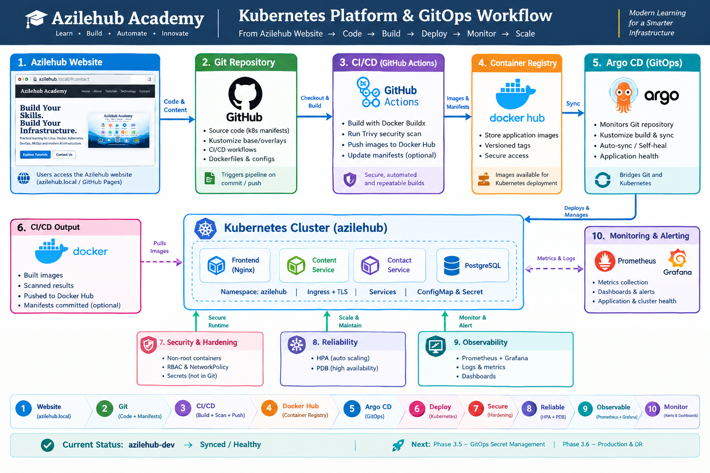
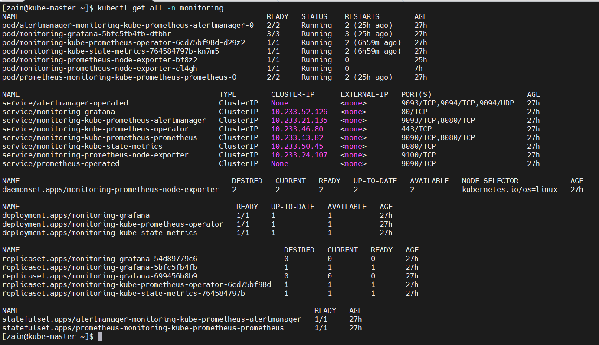
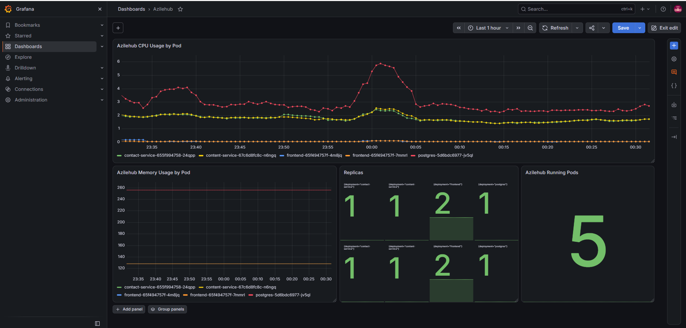
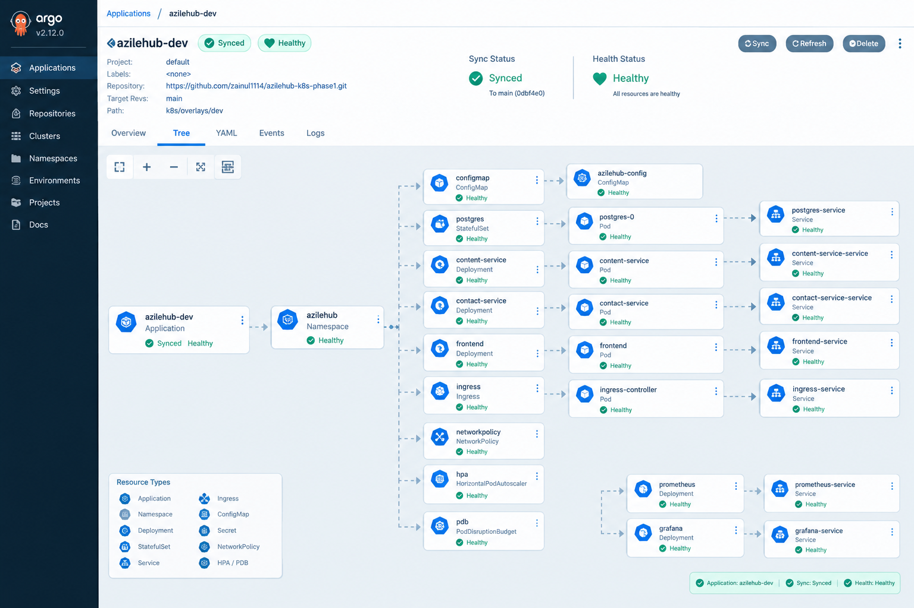
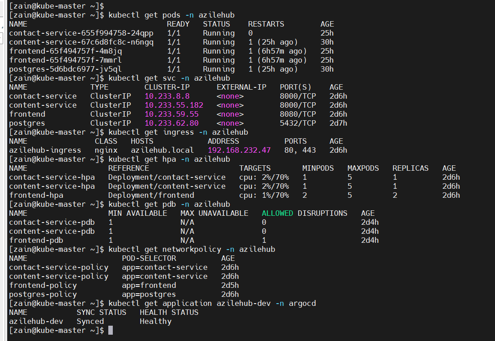

# Azilehub Academy — Kubernetes Platform

> End-to-end Kubernetes, CI/CD, observability and GitOps platform for the Azilehub Academy website.




---

## Project Overview

This project deploys the Azilehub Academy application on Kubernetes and evolves it from a basic application deployment into a structured platform with:

- Kubernetes application workloads
- PostgreSQL persistence
- Ingress and TLS
- ConfigMap and Secret configuration
- Resource requests and limits
- Horizontal Pod Autoscaling (HPA)
- PodDisruptionBudgets (PDB)
- NetworkPolicies
- Prometheus and Grafana monitoring
- Git and Kustomize environment management
- GitHub Actions CI/CD
- Trivy container image scanning
- Docker Hub image publishing
- Argo CD GitOps deployment

The application runs in the `azilehub` namespace.

---

## Architecture

```text
                         User / Browser
                               |
                               | HTTPS
                               v
                    +----------------------+
                    | NGINX Ingress + TLS  |
                    |  azilehub.local      |
                    +----------+-----------+
                               |
                +--------------+--------------+
                |              |              |
                v              v              v
          +-----------+  +-----------+  +-----------+
          | Frontend  |  | Content   |  | Contact   |
          | NGINX     |  | Service   |  | Service   |
          | :8080     |  | :8000     |  | :8000     |
          +-----------+  +-----+-----+  +-----+-----+
                              |               |
                              +-------+-------+
                                      |
                                      v
                               +-------------+
                               | PostgreSQL  |
                               | :5432       |
                               +-------------+

                    Monitoring / Operations
              Prometheus <---- Kubernetes Metrics
                   |
                   v
                Grafana

                 GitOps
     GitHub -> Argo CD -> Kustomize -> Kubernetes
```

---

## Main Steps Performed

### 1. Application deployment

Deployed the Azilehub Academy application as separate Kubernetes workloads:

| Component | Purpose | Port |
|---|---|---:|
| Frontend | NGINX static website | 8080 |
| Content Service | Tutorial API | 8000 |
| Contact Service | Contact API | 8000 |
| PostgreSQL | Application database | 5432 |

The application is deployed in:

```text
Namespace: azilehub
```

---

### 2. Kubernetes networking

Created Kubernetes Services for stable internal communication:

```text
frontend
content-service
contact-service
postgres
```

Ingress routes external requests:

```text
https://azilehub.local/
        -> frontend

https://azilehub.local/api/tutorials
        -> content-service

https://azilehub.local/api/contact
        -> contact-service
```

TLS was configured for `azilehub.local`.

---

### 3. Configuration and secrets

Introduced centralized application configuration using:

- ConfigMap
- Kubernetes Secret
- PostgreSQL environment configuration

Sensitive files and TLS private keys were excluded from Git using `.gitignore`.

The current GitOps configuration intentionally does not commit the live Secret. Proper GitOps secret management is planned for Phase 3.5.

---

### 4. Security hardening

Application containers were hardened with non-root execution.

Examples:

```text
content-service -> UID 1000
contact-service -> UID 1000
frontend        -> UID 101
```

The frontend additionally uses:

```text
allowPrivilegeEscalation: false
capabilities:
  drop:
    - ALL
```

Temporary writable NGINX directories use `emptyDir` volumes so NGINX can run correctly as a non-root user.

---

### 5. Resource management and autoscaling

Configured CPU and memory requests/limits for application workloads.

Configured HPA:

```text
Minimum replicas: 2
Maximum replicas: 5
CPU target:       70%
```

The HPA allows the frontend and backend services to scale based on CPU utilization.

---

### 6. Reliability

Added PodDisruptionBudgets:

```text
contact-service-pdb
content-service-pdb
frontend-pdb
```

The PDB configuration helps maintain application availability during voluntary disruptions.

Readiness and liveness probes were also used to control traffic and workload health.

---

### 7. NetworkPolicies

Added NetworkPolicies controlling application communication.

The intended traffic model is:

```text
Ingress
   |
   v
Frontend
   |
   +----> Content Service
   |
   +----> Contact Service
                |
                v
            PostgreSQL
```

DNS traffic is explicitly permitted for workloads that require service discovery.

---

### 8. Observability



Installed the `kube-prometheus-stack` monitoring platform.

Main components:

- Prometheus
- Grafana
- Alertmanager
- Node Exporter
- kube-state-metrics
- Prometheus Operator
- Metrics Server

Grafana dashboards were created for the `azilehub` namespace, including:



- Running Pods
- CPU requests
- CPU limits
- Memory requests
- Memory limits
- Actual CPU usage
- Actual memory usage
- Pod restarts

---

## Phase 3 — Git and Kustomize

The project was converted into a Git-managed Kubernetes platform.

### Repository structure

```text
k8s/
├── base/
│   ├── namespace.yaml
│   ├── configmap.yaml
│   ├── postgres.yaml
│   ├── content-service.yaml
│   ├── contact-service.yaml
│   ├── frontend.yaml
│   ├── services.yaml
│   ├── networkpolicy.yaml
│   ├── hpa.yaml
│   ├── pdb.yaml
│   ├── ingress.yaml
│   └── kustomization.yaml
│
├── overlays/
│   ├── dev/
│   │   └── kustomization.yaml
│   └── prod/
│       └── kustomization.yaml
│
└── phase2/
```

Kustomize provides:

```text
Base
  |
  +---- Dev overlay
  |
  +---- Prod overlay
```

This allows common Kubernetes manifests to be reused while environment-specific settings remain in overlays.

---

## CI/CD Pipeline

GitHub Actions was added to automate the container delivery process.

```text
Git Push
   |
   v
GitHub Actions
   |
   +--> Kustomize validation
   |
   +--> Docker Buildx
   |
   +--> Trivy image scan
   |
   +--> Docker Hub authentication
   |
   +--> Push container images
   v
Docker Hub
```

Published images:

```text
zainul1114/azilehub-frontend:1.0.7
zainul1114/azilehub-content:1.0.1
zainul1114/azilehub-contact:1.0.1
```

Trivy scanning is currently configured as non-blocking so scan findings do not prevent image publication.

---

## GitOps with Argo CD



Argo CD was installed and configured to manage the development environment.

Application:

```text
azilehub-dev
```

Git source:

```text
GitHub
  |
  +-- main
      |
      +-- k8s/overlays/dev
```

Argo CD configuration:

```text
Repository:
https://github.com/zainul1114/azilehub-k8s-phase1.git

Branch:
main

Path:
k8s/overlays/dev

Destination:
azilehub namespace
```

Current status:

```text
azilehub-dev
SYNC STATUS:   Synced
HEALTH STATUS: Healthy
```

GitOps workflow:

```text
Developer
    |
    | git push
    v
GitHub
    |
    v
Argo CD
    |
    | Kustomize build
    v
Desired Kubernetes State
    |
    v
Kubernetes Cluster
    |
    v
Azilehub Application
```

Argo CD automated synchronization and self-healing are enabled for the development application.

---

## Validation

Useful commands:

```bash
kubectl get pods -n azilehub
kubectl get svc -n azilehub
kubectl get ingress -n azilehub
kubectl get hpa -n azilehub
kubectl get pdb -n azilehub
kubectl get networkpolicy -n azilehub
kubectl get application azilehub-dev -n argocd
```

Validate Kustomize:

```bash
kubectl kustomize k8s/overlays/dev
kubectl kustomize k8s/overlays/prod
```

Check Argo CD:

```bash
kubectl get application azilehub-dev -n argocd
```

Expected:

```text
azilehub-dev   Synced   Healthy
```

---

## Project Phases

| Phase | Work | Status |
|---|---|---|
| Phase 1 | Kubernetes application deployment | Completed |
| Phase 2 | Configuration, security, reliability and observability | Completed |
| Phase 3.1 | Git / Kustomize structure | Completed |
| Phase 3.2 | Dev / Prod overlays | Completed |
| Phase 3.3 | GitHub Actions CI/CD | Completed |
| Phase 3.4 | Argo CD GitOps | Completed |
| Phase 3.5 | Advanced security and secret management | Planned |
| Phase 3.6 | Advanced observability / logging | Planned |

---

## What This Project Demonstrates

This project provides practical experience with:

- Linux and Kubernetes administration
- Kubernetes Deployments and Services
- ConfigMaps and Secrets
- PostgreSQL on Kubernetes
- Ingress and TLS
- Kubernetes security contexts
- NetworkPolicies
- HPA and PDB
- Prometheus and Grafana
- Git and GitHub
- Kustomize
- GitHub Actions
- Docker Buildx
- Trivy
- Docker Hub
- Argo CD
- GitOps
- Kubernetes troubleshooting and validation

---

## Next Steps

### Phase 3.5 — Security

Planned improvements:

- GitOps-compatible secret management
- Sealed Secrets or SOPS
- RBAC refinement
- More restrictive NetworkPolicies
- Image vulnerability policy
- Security scanning improvements

### Phase 3.6 — Observability

Planned improvements:

- Centralized logging
- Loki
- Grafana log dashboards
- Application-level metrics
- Alerting improvements

---

## Project Goal

The goal is to build the Azilehub Academy platform using real-world infrastructure practices:

```text
Application
    ↓
Kubernetes
    ↓
Security + Reliability
    ↓
Observability
    ↓
Git + Kustomize
    ↓
CI/CD
    ↓
Container Registry
    ↓
Argo CD
    ↓
GitOps
    ↓
Production-ready Platform
```

---

## Author

**Zainul Abiddin**

Azilehub Academy — DevOps, Kubernetes, MLOps and AI Infrastructure learning platform.
